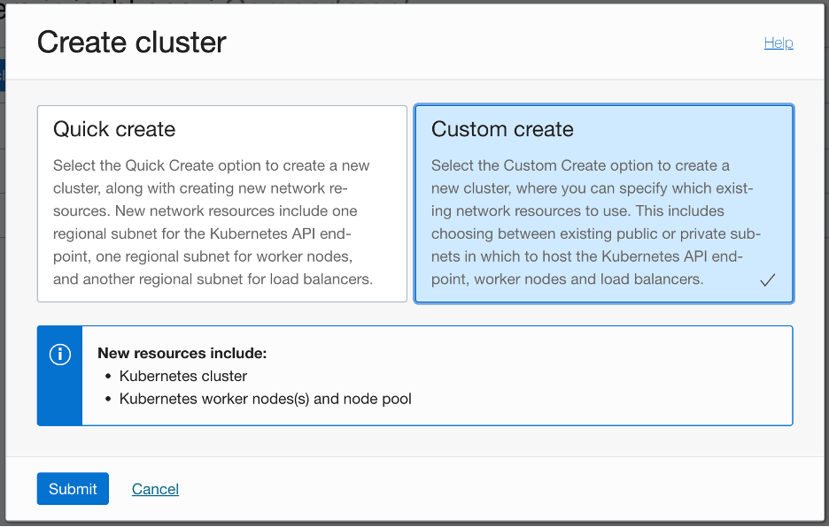
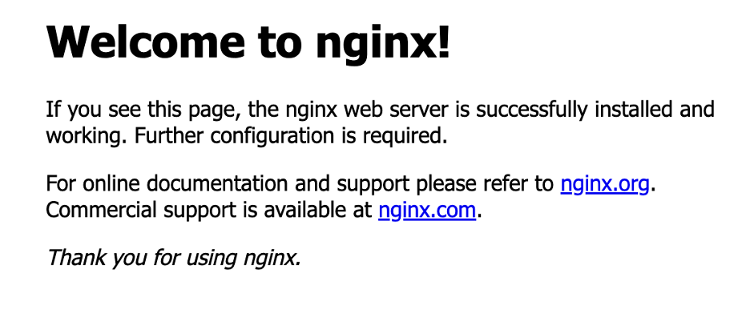
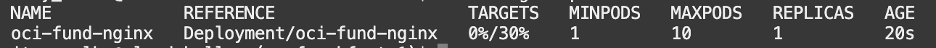
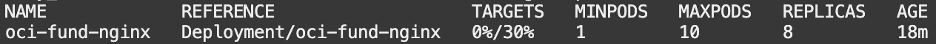

# OKE Workshop!

<ins>**Lab 2 – OKE – Application Autoscaling** </ins>

- **Pre-requisites (for this lab):**

    * Make sure port 80 is open for ingress traffic to your public subnet

1. Create an OKE Cluster (**Custom create**)

   1. First, make sure you're using the right region - Israel Central (Jerusalem)

      

    -	**Name**: Choose your cluster name
    -	**Kubernetes** version: v1.24.1
    -	**Network** Type: Flannel overlay
    -	**VCN**: Choose your VCN
    -	**Kubernetes** Service LB Subnet: Choose your subnets
    -	**Kubernetes API Endpoint Subnet**: Choose your subnet (Public Subnet)
    -	Check “**Assign a public IP address to the API endpoint**”
    -	**Node pool name**: Choose your node pool name
    -	**Version**: Same as the cluster Kubernetes version
    -	**Shape**: VM.Standard.E3.Flex (2 OCPUs, 8GB Memory)
    -	**Image**: Oracle Linux 8
    -	**Number of nodes**: 1
    -	**Placement Configuration**: Select your AD and worker nodes subnet
    -	**Pod Communication**: Choose your subnet for Pods

2. Go to the Cluster page, click on “**Access Cluster**”

      

3.	Launch “**Cloud Shell**” and paste the command grant you the access to your cluster.

4.	**Deploy Metrics Server on the cluster** (The Kubernetes Metrics Server collects resource metrics from the kubelet running on each worker node and exposes them in the Kubernetes API server through the Kubernetes Metrics API.)

    1. If your OCI user is a tenancy administrator or cluster administrator, skip the next step and go straight to the following step.

        Paste the following command to create the Kubernetes RBAC cluster-admin clusterrole on the cluster (**Note: CHANGE THE <user-OCID\>**):

            kubectl create clusterrolebinding my-cluster-admin-binding --clusterrole=cluster-admin --user=<user-OCID>
    
    2. Deploy the Metrics Server by entering the following command:

            kubectl apply -f https://github.com/kubernetes-sigs/metrics-server/releases/download/v0.6.1/components.yaml

    3. Confirm that the Kubernetes Metrics Server has been deployed successfully and is available by entering:

            kubectl get deployment metrics-server -n kube-system

5. **Clone the code repository**

    Clone the code into your device by running the following command:

        git clone https://github.com/idoashke/OKE.git

6.	**Deploy the Application (NGINX) & Service type LoadBalancer**

    To deploy the web application and its service type LoadBalancer (which will expose the application to the public), run the following command:

        kubectl apply -f nginx.yaml

7.	**Validate the application is running**

    Validate the application is running by running the following command:

        kubectl get pods

8.	**Get the Service Public IP Address**

    Run the following command in order to get the Service Public IP Address:

        kubectl get service oci-fund-nginx

    
 
    Copy the IP Address and paste it in the browser (http://<IP-ADDRESS\>)

    

9.	**Deploy Horizontal Pod Autoscaler (HPA)**

    To deploy the HPA on the cluster, run the following command:

        kubectl autoscale deployment oci-fund-nginx --cpu-percent=30 --min=1 --max=10

10.	**View your HPA**

        kubectl get hpa oci-fund-nginx

    

11.	**Test the HPA**

    We will see how the Autoscaler reacts to increased load. For that, we will create container runs in an infinite loop, sending requests to the **oci-fund-nginx** service.

        kubectl run -i --tty load-generator --rm --image=busybox:1.28 --restart=Never -- /bin/sh -c "while sleep 0.01; do wget -q -O- http://oci-fund-nginx; done

    **Type Enters! (Exit by type Ctrl+C)**

    Wait about ~minute and you should see the higher CPU load:

        kubectl get hpa -w

    **(Exit by type Ctrl+C)**

    

12.	**Deploy OKE Cluster Autoscaler**
    Deploy the OKE Cluster Autoscaler by using the following documentation:
    
    https://docs.oracle.com/en-us/iaas/Content/ContEng/Tasks/contengusingclusterautoscaler.htm#Working_with_the_Cluster_Autoscaler

	Follow the instructions and validate that the number of nodes increased on the cluster.

